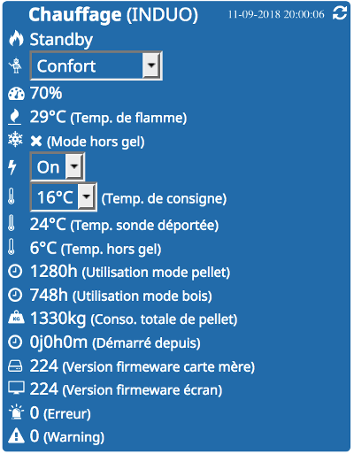
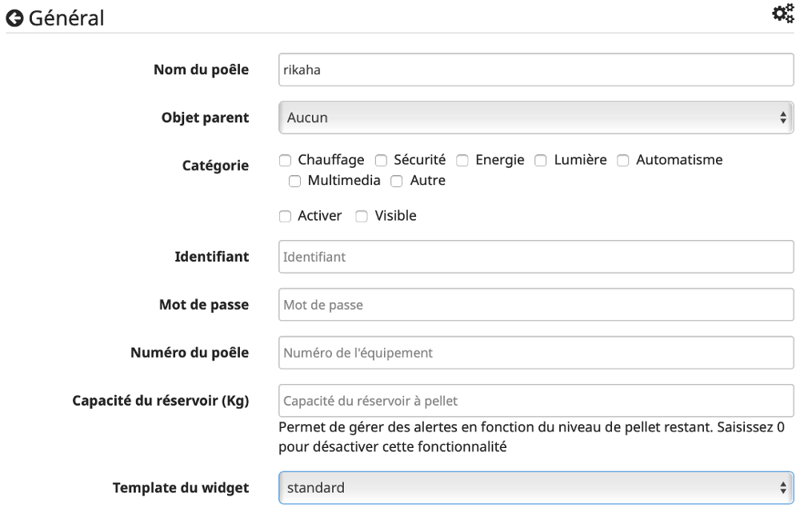

Présentation
============

**Le plugin Rikaha** interface les poêles de la marque Autrichienne Rika avec Jeedom.

Les principales fonctionnalités de Rikaha sont :

**Le monitoring**
> De nombreuses informations sont accessibles et permettent le monitoring de votre poêle dans votre Jeedom.

Ex: La puissance de chauffre, la température de consigne, la température de flamme, la température de la sonde externe, la consommation de pellets ...

**Le pilotage**
> Vous pouvez depuis votre Jeedom piloter des fonctionnalités du poêle. En particulier vous pouvez modifier la température de consigne, le mode de fonctionnement (Manuel, Automatique, Confort)

**Le widget Rikaha**

**Informations**

_Il est nécessaire que le poêle soit equipé du système Firenet._

Le développement du plugin est basé sur le modèle Induo

Le plugin Rikaha a été testé sur les modèles :
1. Induo

Vous pouvez me contacter afin d'ajouter d'autres modèles à la liste

**Activation**

Une seule action, vous devez cliquer sur _Activer_.
Le plugin est croné toute les 30 mn.

**Creation de votre équipement**

Après avoir nommé l'équipement saisissez :

 1. L'identifiant de votre compte Firenet dans le champ Identifiant
 2. Le mot de passe de votre compte Firenet dans le champ Mot de passe
 3. Le numero identifiant votre poêle dans le champ Numéro de l'équipement

Ce numero est présent dans l'url lorsque vous êtes conecté sur le site firenet.

Ex : `https://www.rika-firenet.com/web/stove/xxxxxxxx`

"xxxxxxxx" est la valeur à renseigner dans le champ Numéro de l'équipement

N'oubliez pas de sauvegarder !

Félicitation, vous avez terminé la configuration.

Vous pouvez actualiser manuellement les informations en cliquant sur l'icone située en haut à droite du widget.
